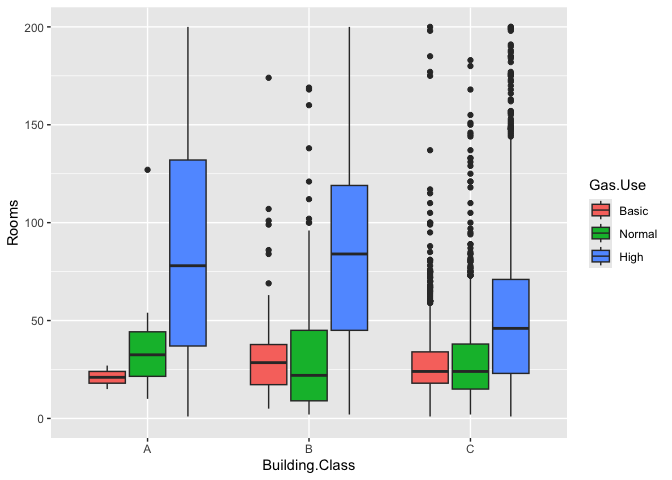
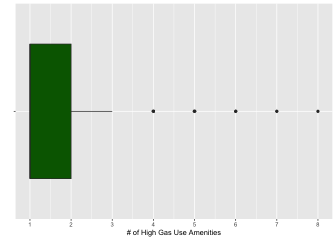

UCLA_Hotels
================

There are 7,308 operating hotels in California.

## Overall Hotel Characterization

On average, hotels have 1-2 amenities that likely use space, cooking, or
water heating. About 34% of them have been renovated, less than 1% are
on Energy Star or LEED Certified.

<!-- --> More
than half of hotels have under 50 rooms, are built before 1990, are
operated independently, and have a building class of C. C Class
buildings are often older, require significant renovation, and may be
located in less desirable areas.

Equipment and energy retrofits at chain management hotels (e.g., Hilton,
Marriott, Hyatt) are typically systematic and strategically coordinated
efforts. Most chain hotels operate under a centralized corporate
strategy, especially when managed directly by the brand (not
franchisees). The corporate sustainability or facilities management team
sets the overarching goals and assesses its properties to identify the
best candidates for retrofits.

<!-- -->

Over half of hotels are Economy - Midscale, and located in Suburban or
Small Town areas.

<!-- -->

For the roughly 25% of hotels with restaurants on site, it’s important
to note that it’s usually only Luxury and Full-Service Chain Hotels who
actually own them. It’s likely that economy to mid scale, independently
operated hotels lease out restaurant space they may have. 65% of hotels
have amenities that likely use cooking, space, and water heating.

### Exclude Chain Management

Considering chain hotels don’t often own individual energy retrofit
decision-making, let’s look at Franchise or Independently operated ones
more closely.

65% of these hotels also have high gas use amenities. 32% have been
renovated, virtually none are on Energy Star, less than 1% are LEED
Certified.

<!-- -->

The large majority of franchise or independently operated hotels are
also older, requiring renovation, and located in less desirable areas.
They also have fewer than 100 rooms, are built before the year 2000, and
were last renovated earlier than 2015, if at all.

<!-- --><!-- --><!-- --><!-- -->

About 65% of hotels have high gas use amenities. Those with High Gas Use
amenities typically have more rooms, ranging from 50-100, are built
around 1980, and have been renovated around 2015, if at all. These
hotels tend to have a more recent vintage.

#### Building Class

<!-- --><!-- --><!-- --><!-- -->

It seems as buildings get older, more in need of renovation, and located
in less desirable areas, they tend to have fewer rooms. Fewer of them
have high gas use amenities as well. Let’s look at how overall amenities
compare to those with high gas use across hotel size, building class,
hotel class, and location type.

#### Amenities Trends

<!-- --><!-- --><!-- -->

There are still a good amount of hotels with 50 or less rooms that have
high gas use amenities. As Building Class and Hotel Class reach a higher
grade, the number of amenities and high gas use amenities go up.

#### Hotel Class

<!-- --><!-- --><!-- --><!-- -->

About 60% of independent hotels are Economy or Midscale, have less than
50 rooms, and were built before 1980. It seems that higher hotel classes
have more hotels with high gas use amenities. These types of amenities
also seem to be at hotels with more rooms, typically at or above 50.

#### Location Type

<!-- --><!-- --><!-- --><!-- -->

Over 60% of hotels are located in Small or Suburban towns, and about 65%
of hotels in each of these location types have high gas use amenities.
Hotels with high gas use have fewer rooms in Small Towns and Resorts,
where they also have older vintages (before 1980). Bigger hotels in
Suburban Towns and Airports have higher gas use as well, where they are
built after 1980.

### Equitability

In seeking equitable electrification opportunities, we may want to focus
on those at Economy - Midscale Class hotels with a B or C Building
Class. Although the number of high gas use amenities increases at
bigger, higher class hotels, we still see a substantial amount of high
gas usage at lower class hotels that tend to be smaller. Perhaps we can
also find larger lower class hotels with a large number of high gas use
amenities.

This cuts our pool of hotels down to 3,872.

<!-- --><!-- -->

Nearly half of these hotels have high gas use amenities, and are still
concentrated in small and suburban towns.

<!-- --><!-- -->

<!-- -->

Interstate and Resort locations have the highest amount of hotels with
high gas use amenities, albeit representing about 10% of all hotels in
this “equitability” category. Lets look at hotels with high gas use.

#### High Gas Use

<!-- -->

Close to 70% of High Gas Use hotels positioned for equitability are in
Small and Suburban towns.

<!-- --><!-- -->

<!-- --><!-- -->

<!-- --><!-- -->

They are typically built between 1960 and 1985, have 25-75 rooms, and
have 1-2 high gas use amenities
